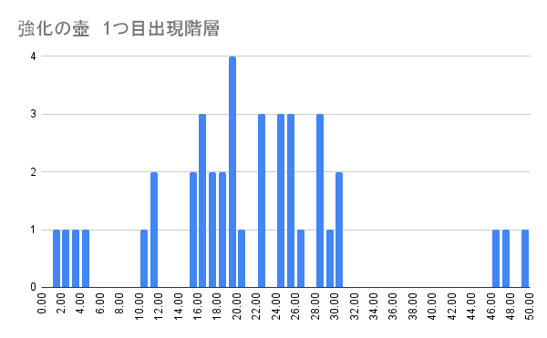
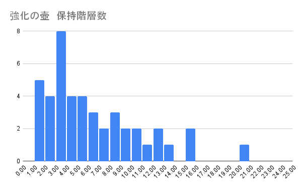

# シレン6　とぐろ島の神髄TAについて

1. [シレン6　とぐろ島の神髄TAについて](#シレン6とぐろ島の神髄taについて)
   1. [はじめに](#はじめに)
   2. [方針](#方針)
   3. [タイムについて](#タイムについて)
      1. [目標タイム](#目標タイム)
      2. [加速要素](#加速要素)
   4. [階層別の動き](#階層別の動き)
   5. [ねだやし対象](#ねだやし対象)
   6. [白紙の巻物](#白紙の巻物)
   7. [強化の壺](#強化の壺)
      1. [出現階層](#出現階層)
      2. [保持階層](#保持階層)
      3. [優先順位](#優先順位)
   8. [腕輪](#腕輪)
   9. [印](#印)
      1. [武器](#武器)
      2. [盾](#盾)
   10. [金印/腹印](#金印腹印)
       1. [ダメージ計算](#ダメージ計算)
       2. [金印 必要ギタン](#金印-必要ギタン)
       3. [腹印 必要満腹度](#腹印-必要満腹度)
   11. [泥棒](#泥棒)
   12. [ボヨヨンの壁](#ボヨヨンの壁)
   13. [桃まんの杖](#桃まんの杖)
   14. [タイム短縮に向け今後の課題](#タイム短縮に向け今後の課題)
       1. [アイテムを使用する判断](#アイテムを使用する判断)
       2. [壁抜けの腕輪](#壁抜けの腕輪)
       3. [アイテムの取捨選択](#アイテムの取捨選択)
       4. [武器盾合成](#武器盾合成)
       5. [泥棒](#泥棒-1)
       6. [マップの巡回順](#マップの巡回順)
   15. [名付け](#名付け)
       1. [壺](#壺)
       2. [草](#草)
       3. [巻物](#巻物)
       4. [腕輪](#腕輪-1)
       5. [杖](#杖)
   16. [目標タイム](#目標タイム-1)
       1. [足切り](#足切り)
       2. [加速要素](#加速要素-1)
   17. [参考](#参考)

## はじめに
自己ベスト 1:45:56

現状のTAについて、自分目線で考えていることを記載していく。
記録をつけだしてからは336回冒険をした。内クリアは8回。
以下の内容では、記録をしている中でのデータを記載している。

## 方針
- 壁抜けの腕輪がない場合
超火力によるごり押しで進んでいく。腹印、金印の運用を前提とした立ち回りをしていく。
- 壁抜けの腕輪がある場合
モンスターと戦わない立ち回りをしていく。

壁抜けの腕輪の出現率が低いので、ない場合を想定し、そこからある場合に移行していく。

## タイムについて
タイムを出すには、壁抜けの腕輪、強化の壺(導きの杖)が必要になる。それらがなければ2:20:00程度の走りになる。

自分の実力では壁抜けの腕輪の練度が低いため、武器盾の強さが壁抜けの腕輪と同じタイムがでる。

今の自分のTAの結果から算出すると、壁抜けの腕輪は-30min、導きの杖は1回で-1minの短縮される。武器盾の強さは-30minの短縮される。未経験だが壁抜けの腕輪と武器盾の強さでは-40min程度になるだろう

### 目標タイム

|壁抜けの腕輪|導きの杖[30]|目標タイム|1F-40F|41F-99F|
|:--:|:--:|---:|---:|---:|
|×|×|2:20:00|1:00:00|1:20:00|
|〇|×|1:50:00|0:50:00|1:00:00|
|×|〇|1:50:00|1:00:00|0:50:00|
|〇|〇|1:20:00|0:50:00|0:30:00|

### 加速要素
- 壁抜けの腕輪
  最速のタイムを目指すには必須。ない場合でも、早いタイムはでる。  
  10Fまでの出現率(0.8% = 3/336)。なかなか出ない
  三角飛びやモンスターの追尾など、壁抜けの腕輪の特性を理解しないと速度は出ない。
  壁抜けの腕輪の練度が低い為、練習が必要。敵と戦わずに回避する動作を身に着ける。

- 武器の強さ
  高ければ高いほどいい
  武器の強さ50に腹印と金印は欲しい。最低限30に腹印か金印は欲しい。
  神器による剣の強さ15に、修正値+35程度が目安。
  - 修正値
  +20であれば、剣の修正値、天の恵みの巻物、クロンの挑戦などで集まる。
  それ以上は強化の壺が必要になる

- 導きの杖  
  必須。 
  経験上1回1minの短縮になる。
  床落ちでは2-4回のため、回数を増やす必要がある。強化の壺、クロンの挑戦(+20)、ボヨヨンの壁で増やせればチャンスがある。特にクロンの挑戦が来た場合、時間やアイテムを消費してでも達成したい。

- 一時しのぎの杖
  透視の腕輪、気配察知の腕輪との組み合わせで、導きの杖の互換になる。とんだ先を見失いがち。  
  回数は4-6回。導きの杖より多いため、腕輪がある場合はボヨヨンの壁では導きの杖より優先度は上がる。

- トンネルの杖  
  壁抜けの腕輪がない場合、階段サーチ後の移動に重宝するので、優先は高い。行き止まりにいった場合のショートカットに使用する。

## 階層別の動き
低層ループの基準
3Fまでに、神器、レベリング、腕輪、力が出なければあきらめる。
10Fまでに、道具寄せの巻物を期待し、加速要素がなければあきらめる。

10F10minはかかるので、なるべく3Fであきらめる。

- 1F-2F  
武器盾がでなければあきらめる。  
白紙は、魔物部屋の巻物にする。
あなぐらマムルのレベリングが可能なら狙う

- 3F  
神器、レベリング、腕輪、力が出なければあきらめる。

- 5F-7F  
毒サソリがいるので即降り
ギタン、封印の杖、弓矢があれば使用していく。

- 10F  
加速要素がなければ、白紙の巻物を道具寄せの巻物にして使用する。
10F-29Fにマゼルンがでるため、合成順序、マゼルンの対処を考えておく。
10F以降は即降りする

- 33F-39F  
腹印の時は、最大満腹度を下げすぎないように立ち回る

- 40F-41F  
マゼモンの合成。ここで武器盾を完成させる。
アイテム欄が圧迫していれば、杖も合成する

- 50F-59F  
一時しのぎの杖があれば10割バッターに使用し、階段に飛ぶ。

## ねだやし対象
戦車と冥王orアークドラゴンは必須。
戦車、ミラクルチキン、冥王が多い

壁抜けありの場合
死神、戦車、パコレプキング、冥王

- 16F-18F  
  - オヤジ戦車  
    白紙に余裕があり、アイテム欄が圧迫している場合、40Fに向けて事前にねだやす。
- 33F-39F  
  - うたうポリゴン  
    死神が余裕で、白紙に余裕があればあり。
    腹印の時は満腹度が減るとつらくなるのであり。
- 40F-49F  
  - ガンコ戦車,ゴウジョウ戦車,イッテツ戦車  
    白紙があれば必須。できなくても頑張れるケースもあるが、なければここで終了する。
- 50F-59F  
　ねだやしをしない場合が多い
  - 大鬼サソリ  
    殴れるぐらいの火力を狙うため、直接殴る場合が多い
  - オドロ,チドロ  
    殴れるぐらいの火力を狙うため、直接殴る場合が多い
- 66F-79F  
  ミラクルチキンが多い。
  - ミラクルチキン  
    盾の強さが30ならこれ。50なら印と相談しこれ。
  - ガイコツまてん  
  - シハン  
  - パコレプキング
- 80F-99F  
　冥王が多い。武器盾が強い場合は、アークの対処によりどちらか決める
  - 冥王  
  - アークドラゴン

## 白紙の巻物
- 壺増大の巻物  
  強化の壺が出た場合ほぼ必須で読んでいる。

- 吸出しの巻物  
  強化の壺から吸いだし、別のアイテムを入れる
  (あまり実施したことはない)

- ねだやしの巻物  
  戦車と冥王orアークドラゴンは必須。
  それ以外は、アイテムと相談する。

- 大部屋の巻物  
  金印のための泥棒や、願いの祠に行くため、終盤での階段サーチのために読む。
  大部屋にした後のモンスターの対処がないと終了するときがある。
  泥棒のためには、階段上の店主をどかす手段が必要。
  - 大部屋後の対処  
    - 場所替えの杖
    - 飛びつきの杖
    - 視界不良のお香

- あかりの巻物  
  終盤で階段サーチのために読む。
  筏マップの時は、導きの杖よりもあかりの巻物がいい。
  視界不良のお香との相性が悪い。
  あかりの巻物 -> 視界不良のお香、あかりの効果がなくなり階段位置もマップもわからなくなる。
  視界不良のお香 -> あかりの巻物、視界不良のお香の効果がなくなる。

- 全滅の巻物  
  終盤での大部屋の巻物＋全滅の巻物。
  大部屋モンスターハウスなどの最終手段。

- 魔物部屋の巻物  
  アイテム10個
  1F,2Fで10Fまで行けるアイテムがない場合に使用する。

- 道具寄せの巻物  
  アイテム約20個
  10Fで加速要素がない場合に読む
  20Fは白紙に余裕があれば読む
  終盤でアイテムがなく、白紙に余裕がある場合は読む

- 銀はがしの巻物  
- 印増大の巻物  
  印が足りない時に読む

- 困ったときの巻物  
  腹印用の満腹度、回復アイテムがなくなったときや、モンスターに囲まれたときなど、どうしようもない時。

- バクチの巻物  
  金印運用時に、ギタンが尽きたときに読む。
  0になった場合は、困ったときの巻物が読める。

## 強化の壺
### 出現階層
20F以降まで進んだ34回の冒険の内、強化の壺を拾った回数は16回。47%で強化の壺を拾っている。

強化の壺を合計40回拾った階層別の割合

|階層|拾った回数|確率
|----|----:|----:
|1F-5F|4|10%
|6F-10F|1|2%
|11F-15F|4|10%
|16F-20F|12|30%
|21F-25F|6|15%
|26F-30F|9|22%
|30F-|4|10%

強化の壺は、16F以降の出現率が高い。

### 保持階層
割れる確率を15%と仮定すると(※3)、平均6.66。
割れた回数をカウントすると、平均6.02、中央値5で割れている。
3回が若干多いが、試行回数が少ない影響だろう。

### 優先順位
現状の優先順位
1. 導きの杖
2. 一時しのぎの杖(透視の腕輪or気配察知の腕輪がある場合)
3. 剣
4. 剣
5. 盾
6. 剣
7. 剣

## 腕輪
腕輪の出現率

試行回数 440
|腕輪|回数|3Fまで|10Fまで|確率
|----|---:|---:|---:|---:|
|壁抜けの腕輪|5|1|3|1.1
|透視の腕輪|4|3|4|0.9
|気配察知の腕輪|14|2|6|3.1
|道具感知の腕輪|7|1|3|1.5
|浮遊の腕輪|6|0|0|1.3
|水グモの腕輪|6|1|1|1.3
|忍びの腕輪|13|0|2|2.9

## 印
優先が高い順から記載している

### 武器
- 突
- 腹・金
- 三
- 眠・縛・乱・暗
- 会
- 回
- 連
- 仏・竜・ド・獣
- サビ
- 浮・水・目
- 桃

### 盾
- 米・ゾ
- 腹・金
- 握
- 見・反
- 竜
- 魔
- ト
- 錆
- 告
- 爆

## 金印/腹印
### ダメージ計算
冥王相手にレベル40武器30力13を基準に、印によるダメージの違い。(※1、※2)
金印腹印を2つ入れることで、武器盾の強さ30でも、強さ76と同じダメージを与えられる。

レベル40 力13の時、武器30金印腹印ありと、武器76金印腹印なしは同じダメージ。
|武器|力|金or腹|ダメージ|
|----:|----:|----:|----:|
|30|13|2|92-119|
|45|13|1|92-118|
|76|13|0|92-119|

レベル40 力23の時、武器9金印腹印ありと、武器54金印腹印なしは同じダメージ
|武器|力|金or腹|ダメージ|
|----:|----:|----:|----:|
|9|23|2|90-116|
|29|23|1|93-119|
|54|23|0|93-119|

受けダメージ

|盾|金or腹|受けダメージ|
|----:|----:|----:|
|30|2|17-22|
|51|1|17-22|
|64|0|17-22|

### 金印 必要ギタン
武器の強さ50 + 金印で、50F=50,000ギタン(1F=1,000ギタン)が目安。
追加で盾に入っている場合は、1.5倍の50F=75,000ギタンが目安。

武器の強さ50 + 金印 + 腹印で、50F=20,000ギタン(1F=400ギタン)が目安。
追加で盾に入っている場合は、1.5倍の50F=30,000ギタンが目安。

### 腹印 必要満腹度
金印が50F=50,000ギタンなので、 満腹度は50F=1,000必要。大きなおにぎり10個分。

武器の強さ50 +　腹印で、50F=1,000満腹度(1F=20)が目安。
追加で盾に入っている場合は、1.5倍の50F=1,500が目安。

武器の強さ50 + 金印 + 腹印で、50F=400(1F=8)が目安。
追加で盾に入っている場合は、1.5倍の50F=600が目安。

おにぎりは足りなくなるので、ほかのアイテムを活用する
- 困ったときの巻物  
  満腹度20以下
- 復活の草
- かつおぶし(120=20*6)
- 使い捨ての剣+鰹印(600=20*30)

## 泥棒
金印運用のために、機会があれば積極的に泥棒していく。
- 底抜けの壺
- 山彦のお香 + 一時しのぎの杖 + 復活の草/無敵草
- トンネルの杖 + かなしばりの杖/一時しのぎの杖/土塊の杖 + 場所替えの杖/飛びつきの杖 + ヤキイモ
- 白紙の巻物(大部屋の巻物) + 視界不良のお香

## ボヨヨンの壁
- 強化の壺
- 導きの杖
- 白紙の巻物
- 一時しのぎの杖
- 背中の壺

## 桃まんの杖
- マゼルン
- やみフクロウ
- 冥王

## タイム短縮に向け今後の課題
タイムを短縮するための課題。
1Fごとの時間を計測して、時間がかかっている階層を見直し、改善していく。
2min以上かかっている階層は見直したい。

### アイテムを使用する判断
- アイテムを使用する状況の判断
- 使用するアイテムの判断

### 壁抜けの腕輪
敵を回避する動作の練度をあげる。
現状、10F平均で7min。

### アイテムの取捨選択
アイテム欄を確認しつつ、アイテムの取捨選択の速度をあげていく。
1つ5secかかった場合、道具寄せの巻物で20個来たら100sec、お店で10個だったら45secかかる。
優先度の低いアイテムを早めに使用し、アイテム欄を開ける。

### 武器盾合成
アイテム欄を確認しつつ手順を考えておく
- 合成順序
- マゼルンと距離をとる方法
- マゼルンを倒す方法

### 泥棒
- 泥棒方法
- 単価の高いアイテムのみ売る

### マップの巡回順
縦横の内狭いほうから回る。今は縦を優先して巡回している。

## 名付け

### 壺
|代表的なアイテム|価格帯|名付け|
|----|----|----|
|保存の壺|800/320|あ|
|換金の壺|1000/400|1|
|おはらいの壺|1600/640|2|
|強化候補|1600/640|き|

### 草
|代表的なアイテム|価格帯|名付け|
|----|----|----|
|睡眠草|80/25|あ|
|高飛び|100/40|1|
|いやし|200/80|2|
|復活|400/160|か|

### 巻物
|代表的なアイテム|価格帯|名付け|
|----|----|----|
||300/120|い|
||400/160|か|
||600/240|き|
||1000/400|1|

選択式は「あ」を追加する

### 腕輪
マイナスアイテムは「ぉ」をつける

### 杖
「あ」
- ただの杖
- 転ばぬ先の杖
- 加速の杖

## 目標タイム
1. 1:30:00 切り
2. 1:45:56 自己ベスト更新 

自己ベスト更新を見込める走りをする

41F開始時点での時間で足切り。
0:55
加速要素がない場合、1:20 -> 2:15
加速要素がある場合、0:40 -> 1:35

### 足切り
- 2F
  武器盾レベリングができなければ、あきらめる。パコレプキンに勝てない。
- 3F
  腕輪 > ちから > 武器盾 > レベリングがなければ、あきらめる。
- 10F
  道具寄せ。加速要素のアイテムの有無により、あきらめる
  目安 武器盾15、力10、腕輪
- 21F
  30min or 加速要素のアイテムの有無により、あきらめる
  ここまでに強化の壺と導きが欲しい
  目安　武器盾20、力13、腕輪
- 31F
  40min or 加速要素のアイテムの有無により、あきらめる
  目安 武器盾30、力15、腕輪
- 41F
  50min or 加速要素のアイテムの有無により、あきらめる
  目安 武器盾50、力15、腕輪

### 加速要素
- 壁抜けの腕輪
- 導きの杖 +30
- 剣50+腹金印 or 剣70+腹or金印
  (マゼモンに150、カエンポフ1確が目安)

## 参考
- ※1 [風来のシレン6～ダメージ計算について～](https://note.com/feketerigo6/n/n44e373fda515)
- ※2 [【暫定】シレン6  ダメージ計算](https://koyubistrong.github.io/index.html?id=section_shiren6)
- ※3 [強化の壺の割れ方について](https://note.com/213414/n/nd05261740fe7)

